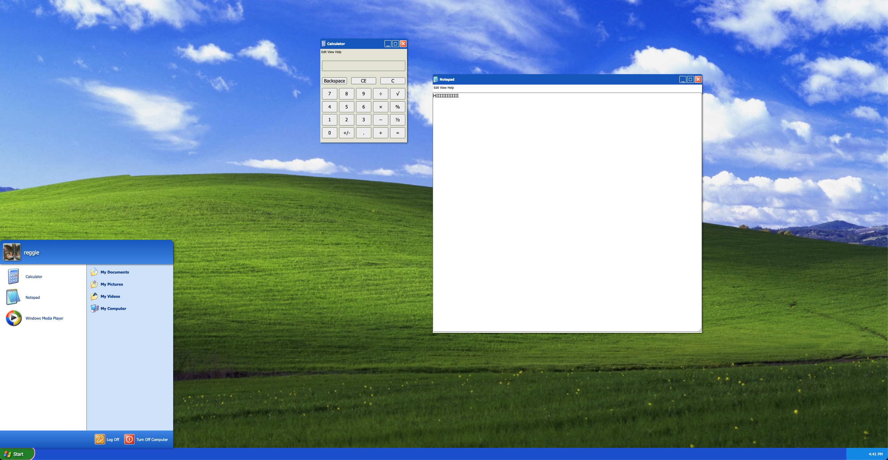
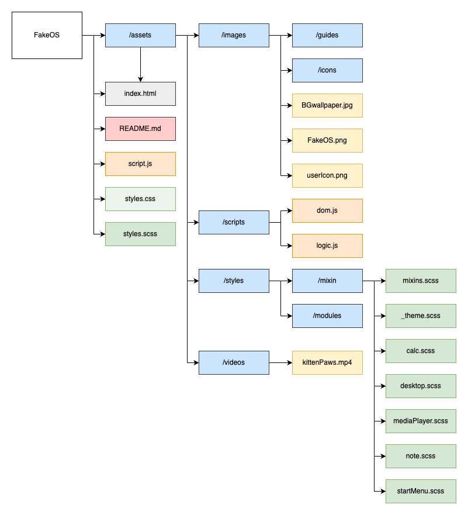
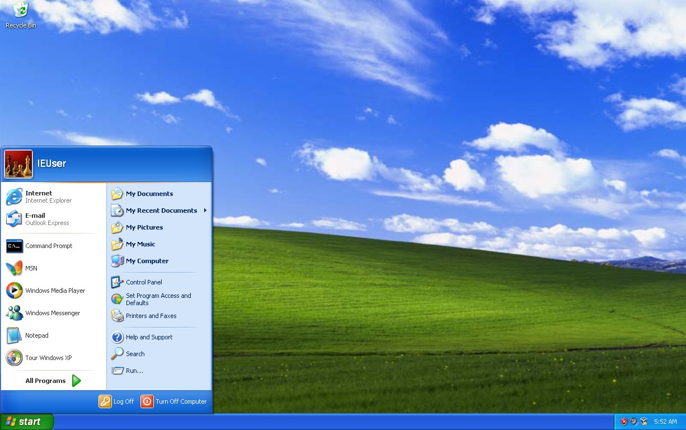

# FakeOS

{add test badges here, all projects you build from here on out will have tests,
therefore you should have github workflow badges at the top of your
repositories:
[Github Workflow Badges](https://docs.github.com/en/actions/monitoring-and-troubleshooting-workflows/adding-a-workflow-status-badge)}

## Demo & Snippets

-   [Live link](https://rianns.github.io/FakeOS/)
-   

---

## Requirements / Purpose

### MVP

-   HTML/SCSS:

    -   Wallpaper scales to fit the viewport
    -   Minimum 3 icons on desktop
    -   The menu is positioned in the appropriate place (bottom left on windows,
        top of the screen on android)
    -   Apps look consistent
    -   Menu contains a flex with content inside it
    -   Apps should be able to contain text, an image or a form

-   JavaScript:

    -   Put your js code into separate files
    -   Your icons and menu should add event listener for the click event, don't
        use the html onclick attribute
    -   Give your functions and variables good names
    -   Use the arrow syntax to declare functions

-   Github:

    -   Create a repo on github with a README Clone Repo
    -   Create and checkout develop branch
    -   Push all changes to your develop branch
    -   When submitting create a pull request from develop into main for review
    -   Add coach as a reviewer

-   The goal of this project is to have students explore and consolidate their
    understandings of HTML, CSS and JavaScript. This project will require you to
    replicate the layout and format of a design/image using CSS, add content via
    HTML and control the interactive elements via JavaScript.

-   Stacks used
-   HTML/SCSS: provide layout and styling of the application such as the
    containers for each feature application.
-   JavaScript: provide feature functionality such as hidden containers that
    reveal on button clicks
-   GitHub/Git: used as a repository for the project, and to display the
    application live

---

## Build Steps

### Required installations

SASS/SCSS

```cmd
npm i sass
or
npm install sass
```

### Setup



OS: Windows XP 2000


1. Research was done on what the actual Windows XP looked like:
    - wallpaper background
    - colours
    - icons used
    - font styles and colours
    - how the windows and features moved and behaved when interacted with
      (clicks, hovers, etc)
2. Created GitHub repository with README.md file and cloned in local drive
3. In VSCode, recreated the folder structure and the files gathered were sorted
   in assets folder (background wallpaper and icons)
4. Basic HTML layout was created along with initial styles.scss file
5. I worked on each part in sections

-   Desktop section

    Colour palette

    ```scss
    $main-color-blue: #1f58d9;
    $secondary-color-green: #1e8c1e;
    $tertiary-color-blue: #0a92eb;
    ```

    Font styles

    ```scss
    $primary-font-family: Tahoma, sans-serif;
    $secondary-font-family: Verdana, sans-serif;
    $tertiary-font-family: "Trebuchet MS", sans-serif;
    ```

    Desktop - where the viewpoint size is determined, the rest of the components
    are relative to this setup.

    -   background wallpaper
    -   system clock
    -   desktop icons
    -   application icons in taskbar

    Start Menu - toggled div fixed on the bottom left of viewpoint

    -   buttons for the three featured applications
    -   buttons for a few sample folders
    -   log off and shut down button
    -   user icon

    Calculator (TBD)

    Notepad (TBD)

    Video Player

    -   play, pause, stop buttons

---

## Design Goals / Approach

-   The project's goal is creating a "Fake OS". In terms of the visual design, I
    wanted to stay true to the operating system that I based my project on -
    Windows XP, so I researched the styling and palette that was used for it.
    When it comes to the code, I wanted to split the code into different
    sections based on which feature it is for. Sort of acting as modules in the
    same script file. In the future, I wish to update this to be in separate
    files to have more concise code.

---

## Features

-   Calculator
-   Notepad
-   Video Player
-   System clock

---

## Known issues

-   Cannot resize video player
-   Application icons do not show on taskbar when applications are open

---

## Future Goals

-   Calculator functionality
-   Save feature for Notepad (into .txt)
-   Save file destination can be chosen
-   Open different video files in player
-   Desktop icons for applications
-   Application icons show on taskbar if opened

---

## Change logs

### 03/04/2023 - Submission commit

-   added FakeOS with desktop functionality
-   windows behaviours (e.g. moving whole windows by holding top header)

---

## What did you struggle with?

-   My biggest struggle with this project was the planning and time management.
    This was our first project mainly focused on JavaScript and I gave too much
    of an emphasis to the HTML/CSS part of this project. So I ended up with less
    time than I should have to code the JS. If I were to do this project again,
    I would timebox the HTML/CSS part into 2-3 days' worth of work, and just
    focus on the rest on the functionality of the features.

---

## Licensing Details

-   No license

---

## Further details, related projects, reimplementations

-   This is a Single Page Application implemented using HTML, CSS, and
    JavaScript
